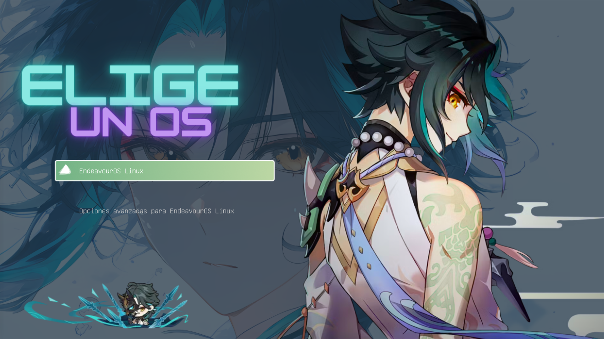
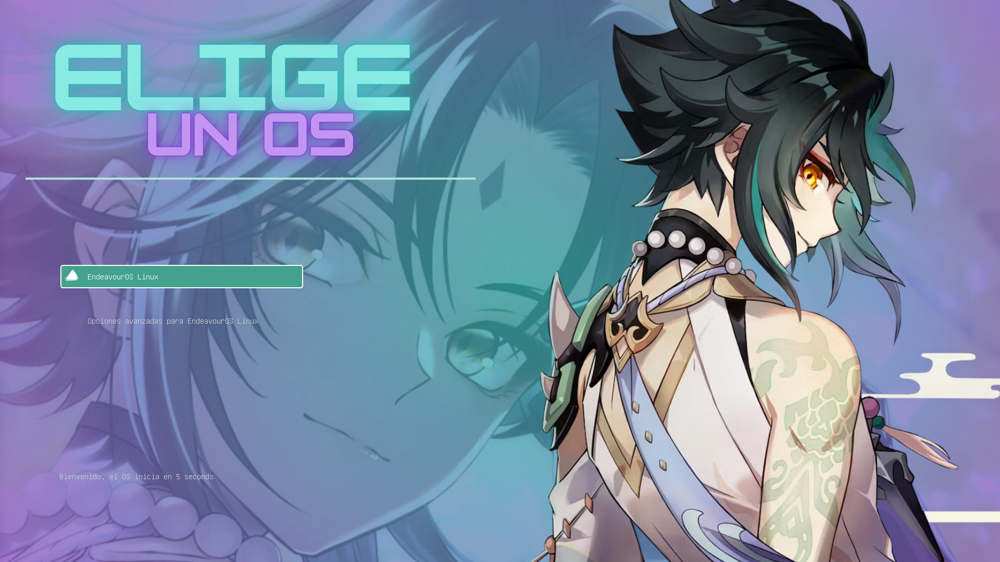
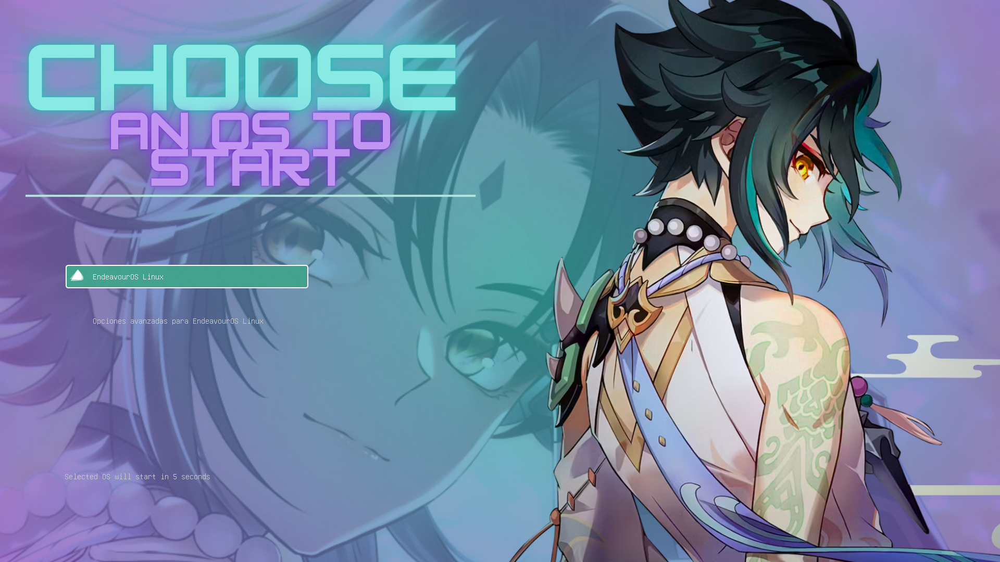

### 🍃 Contents 🍃

<a></a>
<br/><br/>

- <b>[🖥️ GRUB Themes](#previews)</b>
   - [Ver. 1](#1)
   - [Ver. 2](#2)
   - [Eng ver. 2](#eng2)

- <b>[🔧 Installation](#installation)</b>
  - [First method](#first-method)
  - [Second method (wip script, soon)](#)


## Installation

### First Method

<a></a>
- Open your terminal
- Copy the repository and unzip

```
    git clone https://github.com/Zerabalus/Xiao-Genshin-GRUB-themes.git
```
On your terminal go to:
```
    cd Xiao-Genshin-GRUB-themes/Xiao-Themes/
``` 
- Give permissions to script:

```
    chmod +x install.sh
```
```
    chmod +x uninstall.sh
``` 

- Using Xiao Grub as an example:

- Only run:
```
    sudo ./install Xiao
```
```
    sudo update-grub
```
```
    sudo grub-mkconfig -o /boot/grub/grub.cfg      #if you use Arch, use this instead "sudo update-grub"
```
- Reboot your PC.

> [!WARNING]  
> Make sure that the theme exists. 

List of Themes:
* Xiao
* Xiaov2
* XiaoEngv2

## Previews

### 1.

<div align="center" style="display:inline">
  
</div>

### 2.

<div align="center" style="display:inline">
  
</div>

### Eng2

<div align="center" style="display:inline">
  
</div>
